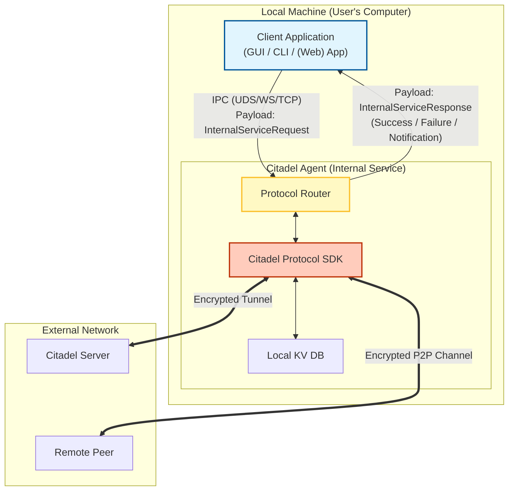
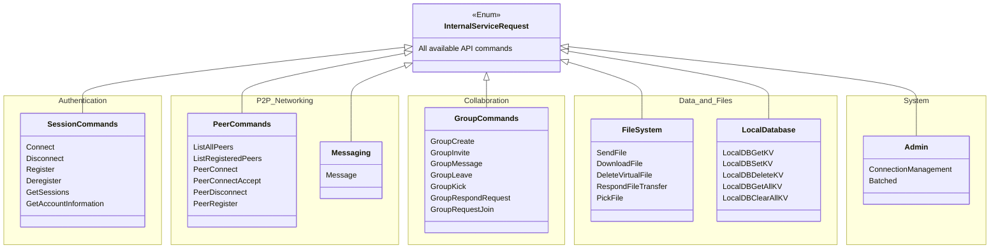
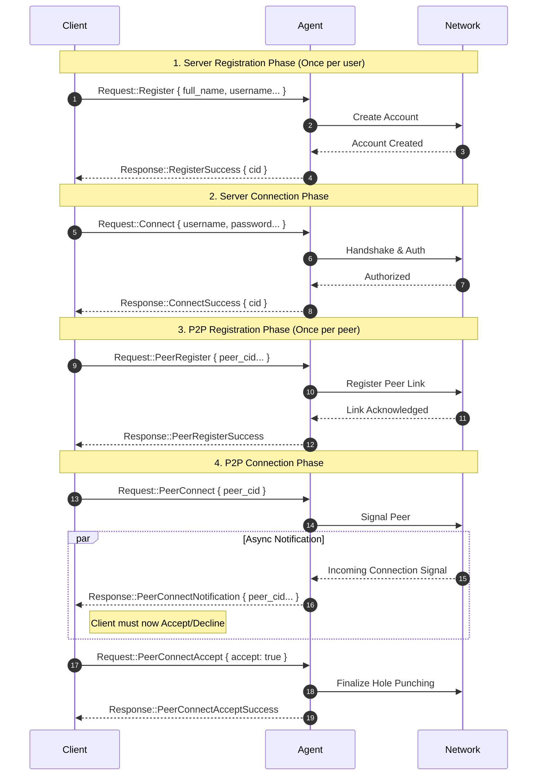
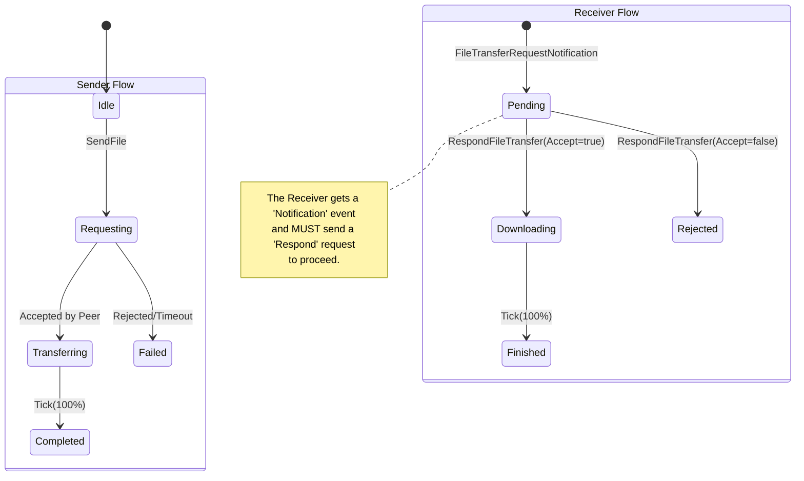
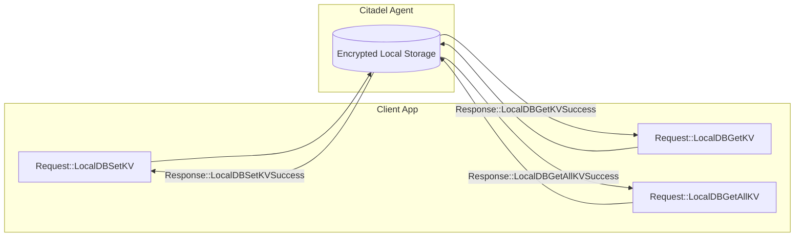

# 🛡️ Citadel Internal Service

The **Citadel Internal Service** (also referred to as the **Citadel Agent**) is a local daemon (`citadeld`) that manages the lifecycle of secure connections for developer applications. 

It sits architecturally between your client applications (CLI, GUI, Web/WASM, etc) and the Citadel Protocol SDK. By exposing a lightweight IPC interface (UDS/TCP/WebSocket), it acts as a **multiplexing agent**, allowing multiple local apps to leverage the Citadel Protocol simultaneously without needing to embed the full heavy-weight SDK or manage complex connection states individually.

---

## 📑 Table of Contents

- [🏗️ High-Level Architecture](#-high-level-architecture)
- [🔄 Protocol & API Workflows](#-protocol--api-workflows)
    - [Request/Response Model](#requestresponse-model)
    - [Connection Lifecycle](#connection-lifecycle)
    - [File Transfer Logic](#file-transfer-logic)
    - [Local Key-Value Store](#local-key-value-store)
- [📦 Components](#-components)
- [⚡ Automated TypeScript Generation](#-automated-typescript-generation)
- [🛠️ Development & Usage](#-development--usage)

---

## 🏗️ High-Level Architecture

The Agent abstracts the complexity of the Citadel Protocol SDK. Instead of every app managing its own encrypted tunnels and P2P hole-punching logic, they simply send `InternalServiceRequest` payloads to the Agent, which handles the heavy lifting.



---

## 🔄 Protocol & API Workflows

The Internal Service operates on a strict **Request/Response** pattern, occasionally supplemented by asynchronous **Notifications** (e.g., when a peer sends a message or a file transfer request arrives).

### Request/Response Model

The API surface is defined by the `InternalServiceRequest` enum. Below is a categorical breakdown of available commands.



### Connection Lifecycle

Establishing a connection involves authentication with the central server, followed by P2P handshakes. Note that `PeerConnectNotification` is an async event that requires a subsequent `PeerConnectAccept` request from the client.



### File Transfer Logic

File transfers require a handshake to ensure the recipient is ready to receive data.



### Local Key-Value Store

The Agent provides a secure, encrypted local Key-Value store, allowing client apps to persist state without implementing their own database logic.



---

## 📦 Components

This repository is organized into the following crates:

- **`citadel-internal-service`**: The core daemon implementation.
- **`citadel-internal-service-types`**: Shared type definitions with automated TypeScript generation.
- **`citadel-internal-service-connector`**: Interfaces for handling connections and IO.
- **`typescript-client`**: A generated TypeScript client with WebSocket support.

---

## ⚡ Automated TypeScript Generation

The project features **fully automated TypeScript type generation** from Rust types using [ts-rs](https://github.com/Aleph-Alpha/ts-rs). All types are properly annotated and automatically exported with dependency resolution.

### Quick Start

Generate TypeScript types with a single command:

```bash
./generate_types.sh
```

This script automatically:
- ✅ Builds the Rust crate with TypeScript features
- ✅ Generates all TypeScript types (85+ files) with proper imports  
- ✅ Creates a convenient `index.ts` for easy imports
- ✅ Fixes any missing import statements
- ✅ Verifies TypeScript compilation

### Features

- **Zero Configuration**: Works out of the box.
- **Complete Type Coverage**: All request/response types included.
- **Automatic Imports**: Dependencies resolved automatically.
- **Build Integration**: Types generated directly to `typescript-client/src/types/`.
- **Validation**: Automatically verifies TypeScript compilation.

### Architecture

The automated generation uses `ts-rs` libraries with `#[ts(export)]` annotations, a custom build script, and test-based triggers to ensure complete coverage.

```
citadel-internal-service-types/
├── src/lib.rs                    # All types with #[ts(export)]
├── build.rs                      # Sets TS_RS_EXPORT_DIR
├── examples/generate_ts_types.rs # Export trigger
└── tests/                        # Export tests for all types

typescript-client/src/types/
├── index.ts                      # Convenient re-exports
├── InternalServiceRequest.ts     # Main request enum
├── InternalServiceResponse.ts    # Main response enum
└── *.ts                          # Individual type files (85+)
```

---

## 🛠️ Development & Usage

### Building

```bash
# Build with TypeScript features
cd citadel-internal-service-types
cargo build --features typescript

# Build TypeScript client
cd typescript-client
npm run build
```

### Testing

```bash
# Run Rust tests
cargo test

# Test TypeScript client
cd typescript-client
npm test
```

### Regenerating Types

Simply run the generation script whenever Rust types change. The script is idempotent and safe to run multiple times.

```bash
./generate_types.sh
```